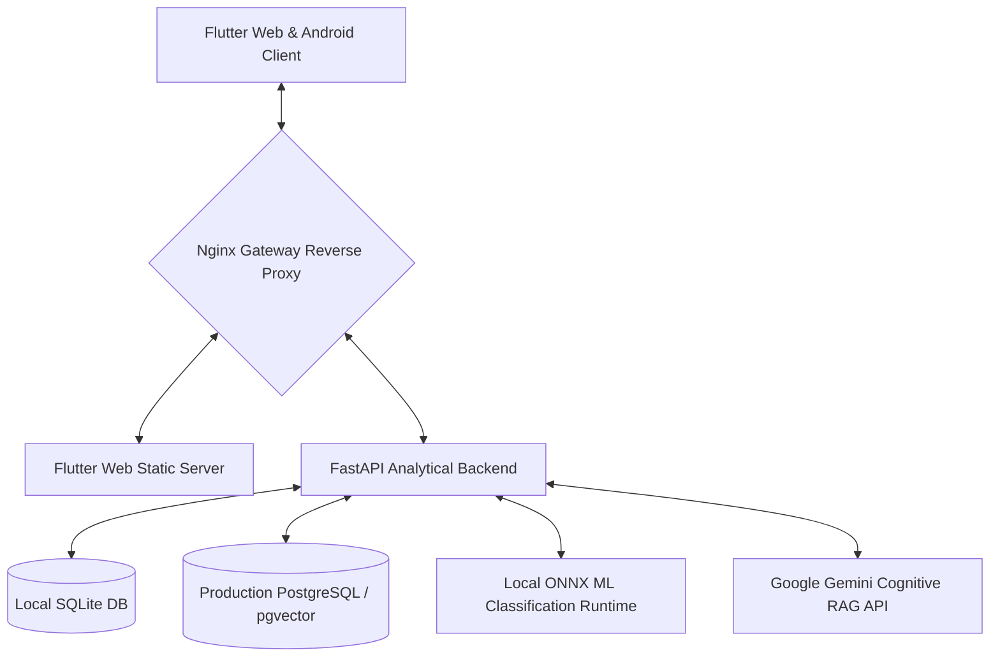

# StatementX 📊🚀✨

**StatementX** is a secure, enterprise-grade, and AI-powered **Bank Statement Analyzer & Financial Coaching Ecosystem**. 

It is designed as an end-to-end multi-tenant application, featuring a cross-platform client (**Flutter Web & native Android**) backed by a high-performance **FastAPI analytical core engine**. It securely processes bank statement ledgers (PDF and CSV format), dynamically labels categories via a localized Machine Learning classification engine, identifies recurring subscription tracks, highlights anomalies, and offers interactive, context-grounded AI financial advice via a semantic RAG chatbot.

---

## 🛠️ Unified System Architecture

StatementX decouples deep analytical processing and vector indexing from the responsive visualization layer to achieve enterprise performance:



* **Frontend ([Flutter Folder](file:///c:/StatementX-1/flutter_frontend/README.md)):** Unified cross-platform app utilizing Google Identity Services (OAuth 2.0) for SSO. Renders interactive financial indicators, budgets, cash flows, and typing chat sessions using glassmorphic UI aesthetics.
* **Backend ([FastAPI Folder](file:///c:/StatementX-1/fastapi_backend/README.md)):** High-speed asynchronous Python engine. Enforces JWT-based session scopes, isolates user multi-tenancy, sanitizes ingested binaries, encrypts tables at rest, and manages vector pipelines.
* **Database & Vector Core:** Integrates platform-agnostic ORM mappings. Employs PostgreSQL with native `pgvector` index clustering in production, alongside custom connection triggers in SQLite for seamless local vector calculations.

---

## 📂 Repository Blueprint

```
StatementX/
├── fastapi_backend/        # FastAPI Core Service, Local ONNX Models & Parsers
├── flutter_frontend/       # Flutter Web & Android Multiplatform Client App
├── nginx/                  # Nginx Proxy Configuration (Gateway Routing & SSL limits)
├── certbot/                # Certbot configuration hooks for auto Let's Encrypt SSL
├── docker-compose.yml      # Multi-container Production Orchestrator
├── setup.sh                # Linux/macOS One-Click Containerization Setup script
├── setup.bat               # Windows One-Click Containerization Setup script
└── readme.md               # Unified Repository Documentation (This file)
```

---

## 🚀 Local Development (Sandboxed Sandbox)

To boot individual modules locally without Docker during development, refer to their dedicated README guides:
* 🐍 **Backend Setup Guide:** [FastAPI Backend README](file:///c:/StatementX-1/fastapi_backend/README.md)
* 📱 **Frontend Setup Guide:** [Flutter Frontend README](file:///c:/StatementX-1/flutter_frontend/README.md)

---

## 🐳 One-Click Production Deployment (Docker Compose)

StatementX provides a production-ready, multi-container orchestration system out of the box using Docker.

### 1. Multi-Container Orchestration Cluster
* **`nginx`:** Gateway reverse proxy binding ports `80` and `443` to route traffic dynamically to static frontend assets or secure backend endpoints.
* **`frontend`:** Serves static web assets securely over Nginx.
* **`backend`:** Asynchronous core service running calculations, loading ONNX classifiers, and handling PDF parsing.
* **`db`:** PostgreSQL database service featuring a native `pgvector/pgvector:16-pgdg` cluster for highly-performant spatial embeddings and transaction lookups.

### 2. Launching via Setup Scripts

We provide one-click initialization setups to verify configuration folders, create directories, and validate environments:

#### On Linux or macOS:
```bash
chmod +x setup.sh
./setup.sh
```

#### On Windows:
```cmd
setup.bat
```

The script will automatically check for a `.env` file at root (using `.env.example` as a template). Ensure you configure the secrets before proceeding:
```ini
POSTGRES_USER=postgres
POSTGRES_PASSWORD=secure_production_db_password
POSTGRES_DB=statementx
GEMINI_API_KEY=your_google_gemini_developer_key
SECRET_KEY=your_high_entropy_jwt_secret
GOOGLE_WEB_CLIENT_ID=your-google-oauth-web-client-id
GOOGLE_ANDROID_CLIENT_ID=your-google-oauth-android-client-id
```

### 3. Spin Up the Containers
Once `.env` is ready, trigger Docker to pull, build, and boot the entire stack in the background:
```bash
docker compose up -d --build
```

### 4. Watch Database Migrations & Logs
Verify the backend container initializes schemas and mounts ONNX weights safely:
```bash
docker compose logs -f backend
```

---

## 🔒 Strict Financial Security & Compliance Guarantees

StatementX is designed to handle highly sensitive personal bank records securely:
1. **No Data Leaks:** Strict multi-tenant row-level access validation ensures a user can never retrieve or query another user's statement records.
2. **Zero-Outside-Memory Chat:** The semantic RAG chatbot is instruction-locked to discuss *only* the local statement context, strictly blocking prompt-injection attempts and general factual hallucination.
3. **Double Guard at Rest:** Slabs of transaction data are encrypted with **AES-256 (Fernet)**, securing confidential accounts even in the event of database physical theft.
4. **Triple-Layer Binary Guard:** Blocks spoofed code scripts, binaries, and null control injections before files are processed by parsing engines.
